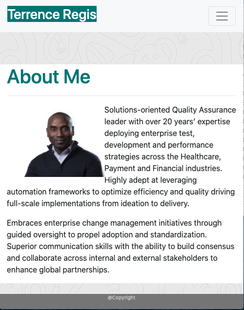
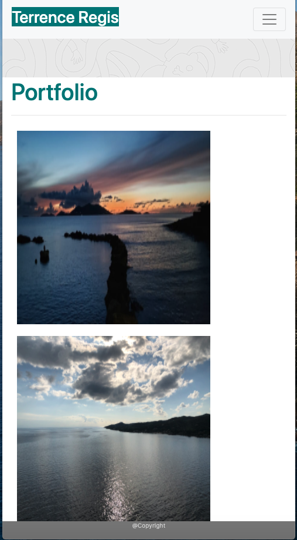

Project Name: Terrence-my-responsive-portfolio
Description: This website has 3 pages: About, Portfolio and Contact. About displace a picture and a short description of me, the portfolio pages has several pictures I have taken and the contact page allows the user to input their name , email address and a short massage for me to contact.

Installation: NA.
Usage: accessing the website, you will get the home/about page which is tells you a little bit about me along with a picture. From the home page, you can navigate using the menu bar to the portfolio page or the contact page. On the portfolio page, you will see several of my pictures. From the portfolio page you can navigate to the contact or about pages. The contact page allows to to enter your name, email and a brief messageif you want me to get intouch with you. From the contact page you can navigate to the about or portfolio pages.

Credits: Big shout out to the TA's and podmates for helping me solve some nagging issues. I am also greatful for the boostrap tools that helped significantly.

Test: 1. Access site, you should be on the landing page. Verify photo and text. (Succeddsful) 2. Click link to the portfolio page. Verify that you go to the portfolio page where you see the photos. (successgul) 3. Clink link to contact page. Verify that you can see and enter a name, an email adrress and a messsage. (Successful)
